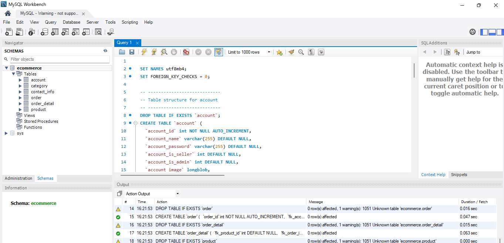

# Ecommerce Website using Java JSP and Servlets

This project is a simple e-commerce website powered by Java JSP and Servlets. Although e-commerce is inherently complex, requiring consideration of numerous edge cases and robust architecture, this project serves as a basic demonstration of fundamental features. It provides a glimpse into the functionality typical of e-commerce systems. Please note that this demo may contain bugs, vulnerabilities, or other issues.

## Prerequisites

Before you begin, ensure you have the following installed:

- Tomcat server 8 or above
- Locally installed MySQL or access to a MySQL server
- A compatible IDE (IntelliJ IDEA is recommended)

## Installing

### Setting Up the MySQL Database

1. Create a new database schema named `ecommerce`.
2. Run the `script.sql` provided in the project folder to set up the necessary tables and data.

### Configuring the Tomcat Application Server

1. Ensure you have Tomcat 8.5.23 or above installed.
2. Compile the project to generate the WAR file.
3. Deploy the WAR file to your Tomcat server.

## Built With

- **Java** - Oracle Java 16 JDK
- **MySQL** - MySQL Database
- **Connector/J** - Connecting to MySQL Database Server
- **Maven** - Dependency Management
- **Shoppers** - Free Bootstrap 4 HTML5 eCommerce website template for the website front-end

## Getting Started

### Step-by-Step Guide

1. **Clone the Repository**
   ```bash
   git clone https://github.com/yourusername/GroupB-Ecommerce-Website.git

2. **Import the Project into Your IDE**

- Open IntelliJ IDEA (or your preferred IDE).
- Import the cloned repository as a Maven project.

3. **Configure the MySQL Database**

- Ensure your MySQL server is running.
- Create the schema and run the SQL script provided in the `sql` folder of the project.
  

4. **Configure Tomcat Server in Your IDE**

- Add a new Tomcat server configuration in your IDE.
- Point the configuration to your Tomcat installation directory.

5. **Deploy and Run the Application**

- Build the project to generate the WAR file.
- Deploy the WAR file to your Tomcat server.
- Start the Tomcat server.

6. **Access the Application**

- Open your web browser and go to `http://localhost:8080/jsp-servlet-ecommerce-website`.

7. **Features**

- User registration and authentication
- Product listing
- Shopping cart
- Order placement
- Basic admin panel for managing products and orders

8. **Contributing**

If you want to contribute to this project:

1. Fork the repository.
2. Create a new branch (`git checkout -b feature/YourFeature`).
3. Commit your changes (`git commit -m 'Add some feature'`).
4. Push to the branch (`git push origin feature/YourFeature`).
5. Open a pull request.

## Acknowledgments

- [Shoppers](https://colorlib.com/wp/template/shoppers/) - Free Bootstrap 4 HTML5 eCommerce website template
